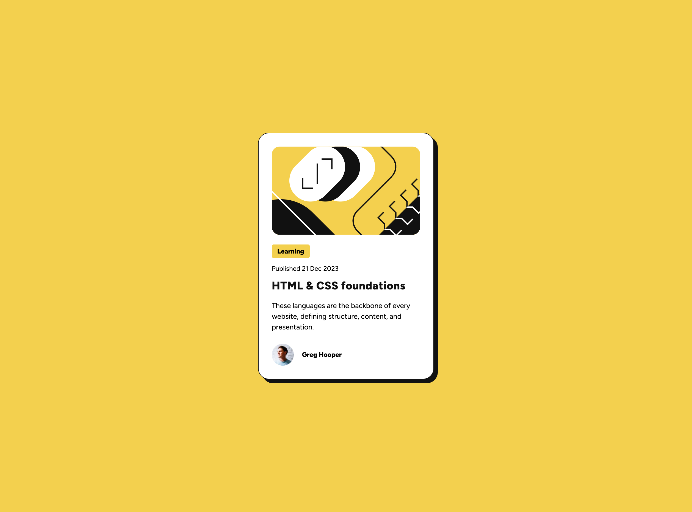

# Blog Preview Card Solution

This is a Blog Preview Card component that you can use on your websites.

## Screenshots

- **Desktop:** 

## Links

- **GitHub Repository:** [View Code](https://github.com/altindaselif/blog-preview-card-main)
- **Live Demo:** [View Live Site](https://altindaselif.github.io/blog-preview-card-main/)

## Built With

- **Semantic HTML5** – meaningful markup for accessibility
- **CSS Custom Properties** – easier theming and maintenance
- **Flexbox** – flexible layout alignment
- **CSS Grid** – for responsive layouts
- **Responsive Design** – adapts to different screen sizes
- **Desktop-First Workflow** – desktop-first, then adapted to smaller devices

## Author

- **LinkedIn:** [Elif Altındaş](https://www.linkedin.com/in/elifaltindas/)
- **Frontend Mentor:** [@altindaselif](https://www.frontendmentor.io/profile/altindaselif)
